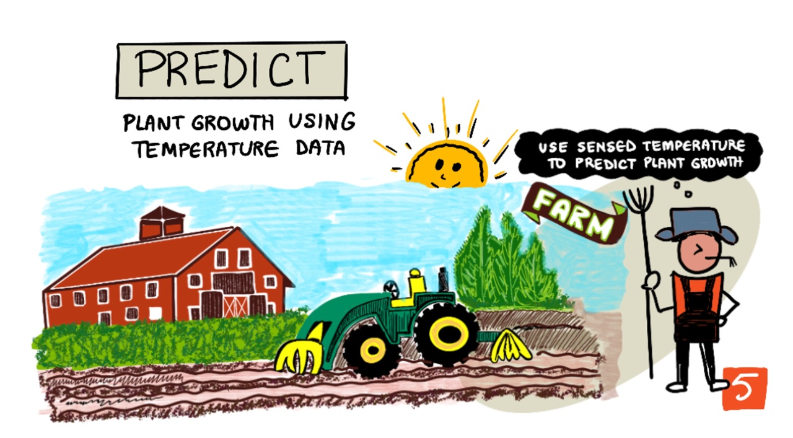

 

#    وصف المشروع

 تطبيقا على مجال انترنت الاشياء, قياس درجة حرارة النبات لمعرفة معدل نمو النبات في اليوم Growing degree days

 #    الهدف من المشروع

 يمكن استخدام المشروع في الزراعة الذكية  حيث يتيح لنا معرفة متى ينمو النبات وذلك من خلال Growing degree days حيث يتم احتسابه من خلال درجة الحرارة

 


#  الادوات المستخدمة 

## => الهاردوير

أ. esp 32


ب. DHt 11 (temperature sensor) 


## => السوفتوير 

### أ.visual studio code 

 ------>استخدام البرنامج لكتابة اكواد السيرفر, يمكن تحميله من [هنا](https://code.visualstudio.com/Download)

### ب.CounterFit

------>   لعمل سيميوليشن لبعض السينسورات  

#  التركيب والتثبيت

## => السوفتوير 
بعد تحميل الاكواد تأكد انك مثبت python على جهازك.

 نفذ هذا الامر في ال terminal .
هذا الامر سوف يظهر لك اصدار بايثون المثبت لديك
```
$ python --version
```
ان لم يكن لديك بايثون فثبتها اولا 
[من هنا](https://www.python.org/downloads/)

هذا الامر لتشغيل ال environment
```
$ .\.venv\Scripts\Activate.ps1
```
بعد ذلك ثبت المكتبات الازمة والتى بداخل ملف ال requirements.txt
```
(.venv) pip install -r requirements.txt
```
## الان يمكنك تشغيل المشروع
اولا شغل ملف ال server.
افتح ملف app.py الموجود بتاخل فولدر server ثم اضفط سهم run  اعلى اليمين 

ثانيا في حالة انك سوف تستخدم Counterfit 
هذا الامر يشغل counterFit server والذي يتعطينا واجهة رسومية للسينسورات التي نستخدمها
```
(.venv)  CounterFit
```
افتح هذا الرباط في المتصفح 
http://localhost:5000/

ثم اتبع الخطوات كما في الصورة


<br>
 افتح ملف app.py الموجود بداخل فولدر virtual-device ثم اضفط سهم run  اعلى اليمين 

 الان اصبح هناك كود السيرفير وكود السينسور . فعند تغير الحرارة ترسل هذه القيمة للبروكير ثم يرسل البروكير القيمة للسيرفير وهنا يقوم السيرفير بتخزين القيمة في ملف <b>csv
<br>

ثالثا افتح كود Growing_Degree_Days.ipynb اعمل تشغيل لجميع الخلايا


<br>
<br>
