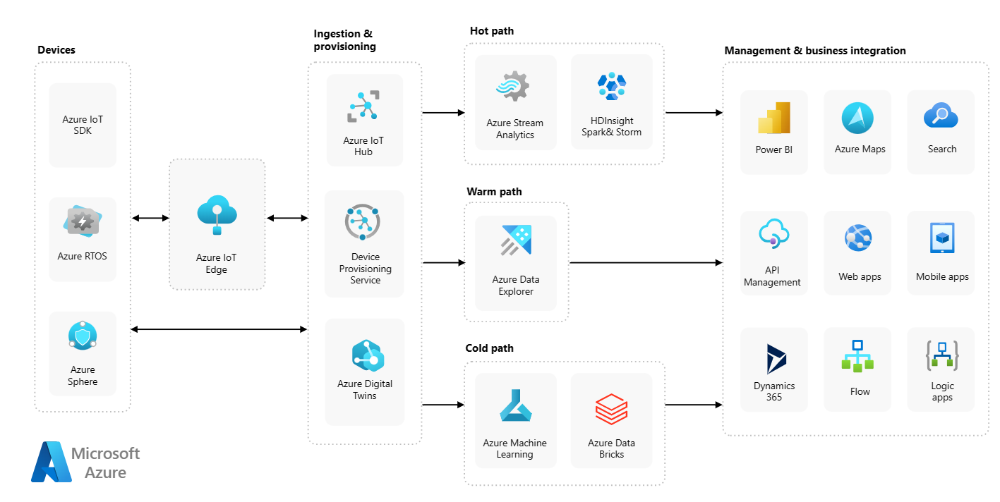

# Truck location with Azure (transporstion)

* Azure IoT architecture
<center>
 
</center>

<br>


* demos
    - [YouTube video](https://youtu.be/Kh5gz_Cb9jI?si=uLlp1DrwDuyT0kBA)


* Azure services
    - Azure IoT hub
    - Azure serverless
    - Azure Functions (IoT Hub event trigger)
    - Azurite
    - Azure Storage (blobs)
    - Azure maps api
    - geofence

* Tools
    - python programming language
    - counterfit (virtual devices)
    - html, javascript
    - geofence.io
* to run the code :
    ```sh
    python3 -m venv .venv
    ```
    ```sh
    .venv\Scripts\activate.bat
    ```
    ```sh
    pip install -r requirements.txt
    ```
    --> to run virtual sensors
    ```sh
    counterfit
    ```
    ## to connect the device to the cloud:

    ### 1- install the Azure CLI from here [ Azure CLI documentation](https://learn.microsoft.com/en-us/cli/azure/install-azure-cli?WT.mc_id=academic-17441-jabenn)

    ### 2- Install the IoT extension by running

    ```sh
    az extension add --name azure-iot
    ```
    ### 3- log in to your Azure subscription from the Azure CLI
    ```sh
    az login
    ```
    the output will be like that
    ```output
    ➜  ~ az account list --output table
    Name                    CloudName    SubscriptionId                        State    IsDefault
    ----------------------  -----------  ------------------------------------  -------  -----------
    School-subscription     AzureCloud   cb30cde9-814a-42f0-a111-754cb788e4e1  Enabled  True
    Azure for Students      AzureCloud   fa51c31b-162c-4599-add6-781def2e1fbf  Enabled  False
    ```
    ### 4- select the subscription you want to use, Replace `<SubscriptionId>` with the Id of the subscription you want to use
    ```sh
    az account set --subscription <SubscriptionId>
    ```
    ### 5- create a resource group
    ```sh
    az account list-locations --output table
    ```
    You will see a list of locations
    ```output
        ➜  ~ az account list-locations --output table
    DisplayName               Name                 RegionalDisplayName
    ------------------------  -------------------  -------------------------------------
    East US                   eastus               (US) East US
    East US 2                 eastus2              (US) East US 2
    South Central US          southcentralus       (US) South Central US
    ...
    ```
    ```sh
    az group create --name <resourceGroupName> --location <location>
    ```
    resourceGroupName have to be unique in your subscription.

    Replace `<location>` with the location you selected in the previous step.
    
    ### 6- create an IoT Hub
    ```sh
    az iot hub create --resource-group <resourceGroupName> --sku F1 --partition-count 2 --name <hub_name>
    ```
    Replace `<hub_name>` with a name for your hub. This name needs to be globally unique - that is no other IoT Hub created by anyone can have the same name. This name is used in a URL that points to the hub, so needs to be unique.
    ### 7- register your IoT device
    ```sh
    az iot hub device-identity create --device-id <deviceID> --hub-name <hub_name>
    ```
    set `<deviceID>` as you want

    Run the following command to get the connection string:
    ```sh
    az iot hub device-identity connection-string show --device-id <deviceID> --output table --hub-name <hub_name>
    ```
    Store the connection string that is shown in the output as you will need it later.
    ### 8- run the `app.py` file in `gps-sensor` folder, but Replace `connection_string` with you get in the previous step.

    ### 9- monitor events
    Run the following command in your command prompt or terminal
    ```sh
    az iot hub monitor-events --hub-name <hub_name>
    ```
    ## Blob storage

    ### 1- install the Azure Functions core tools by following the instructions on the [Azure Functions Core Tools documentation](https://docs.microsoft.com/azure/azure-functions/functions-run-local?WT.mc_id=academic-17441-jabenn)

    ### 2- Run the following command to create a Functions app 
     ```sh
    func init --worker-runtime python soil-moisture-trigger
    ```
    This will create three files inside the current folder
    `host.json`, `local.settings.json`,  `requirements.txt`
    ### 3- Install the necessary Pip packages
    ```sh
    pip install -r requirements.txt
    ```
    ### 4- get the Event Hub compatible endpoint connection string
     ```sh
    az iot hub connection-string show --default-eventhub --output table --hub-name <hub_name>
    ```
    ### 5- open the `local.settings.json` file. Add the following additional value inside the `Values` section:
    ```json
    "IOT_HUB_CONNECTION_STRING": "<connection string>"
    ```
     Replace `<connection string>` with the value from the previous step.

     ### 6- create an event trigger
     * first delete this file `function_app.py`
     ```sh
    func new --name <any Name> --template "Azure Event Hub trigger"
    ```
    This will create a folder called `<any Name>` that contains `__init__.py`and  `function.json`

    ### 7- Update these fields in `function.json`
    ```json
    "connection": "IOT_HUB_CONNECTION_STRING",
    ```
     ```json
    "eventHubName": "",
    ```
    ### 8- replace `__init__.py` code with `__init__.py` code in `gps-trigger` folder

    ### 9- Create a storage account:

    ```sh
    az storage account create --resource-group <resourceGroupName> --sku Standard_LRS --name <storage_name> 
    ```
    ### 10- Run the following command to get the connection string for the storage account:
    ```sh
    az storage account show-connection-string --output table --name <storage_name>
    ```
    Add a new entry to the `local.settings.json` file for your storage account connection string, using the value from the previous step. Name it `STORAGE_CONNECTION_STRING`
    
    
    ### 11- use azurite as locall storage

    install it and you should have node js installed at your machine 
    ```sh
    npm install -g azurite
    ```
    ```sh
    azurite --location azurite
    ```
    it will create folder named azurite

    ### 12- allow blob public access
    ```sh
    az storage account update --name <storage_account_name> --resource-group <resource_group_name> --allow-blob-public-access true
    ```

    ### -->> now you can run your function and test it.
    ```sh
    func start
    ```
    ### `at this point you have gps-sensor app.py code run and sending data to azure and __init__.py event function gets this data and store it as blobs`

    ### 13- verify the uploaded blobs
    ```sh
    az storage account keys list --output table --account-name <storage_name>
    ```
    ```sh
    az storage blob list --container-name gps-data --output table --account-name <storage_name> --account-key <key1>
    ```
    ```sh
    az storage blob download --container-name gps-data --account-name <storage_name> --account-key <key1> --name <blob_name> --file <file_name>
    ```
    Once downloaded, you can open the JSON file, and you will see the blob containing the GPS location details

    <!-- ---------------------------------------------------->

    ## Create an Azure Maps resource

    ```sh 
    az maps account create --name <map-name> --resource-group <resource-group-name> --accept-tos --sku G2 --kind Gen2
    ```

    ### API key for the maps resource
    ```sh
    az maps account keys list --name gps-sensor --resource-group gps-sensor --output table
    ```
    ### at html file `index.html` on map-page folder replace `<subscription_key>` with the API key for your Azure Maps account, and <storage_name> with the name of your storage account. at fetch method

    ### configure storage to be accessed from a web page
    ```sh
    az storage account blob-service-properties cors-rule add --account-name mystorageaccount --resource-group myresourcegroup --allowed-origins "*" --allowed-methods GET --max-age 200
    ```
    ### `now you can open this html file and it will load a map and gps data from storage`

    ## GeoFence
    ### upload geojson file
    #### 1- using postman make post request to 
    ```sh
    https://us.atlas.microsoft.com/mapData/upload?api-version=1.0&dataFormat=geojson&subscription-key=<subscription-key>
    ```
    #### put the body of this request with data on `geofence.geojson file` at geofence data folder
    #### 2- using curl
    ```sh
    curl --request POST 'https://atlas.microsoft.com/mapData/upload?api-version=1.0&dataFormat=geojson subscription-key=<subscription_key>' --header 'Content-Type: application/json' --include --data @geofence.json
    ```
    Replace `<subscription_key>` in the URL with the API key for your Azure Maps account.

    ###  check to see if the upload request has finished
     #### 1- using postman make GET request to 
    ```sh
    <location>&subscription-key=<subscription_key>
    ```
    #### 2- using curl
    ```sh
    curl --request GET '<location>&subscription-key=<subscription_key>'
    ```
    Replace <location> with the value of the location header from previous step, and <subscription_key> with the API key for your Azure Maps account.

    Check the value of status in the response. If it is not Succeeded, then wait a minute and try again.

    Once the status comes back Succeeded, look at the resourceLocation from the response. This contains details on the unique ID (known as a `UDID`) for the GeoJSON object. The UDID is the value after metadata/, and not including the api-version.`Keep a copy of this UDID as you will need it to test the geofence.`

    ## test points against a geofence using postman or curl

    ``` 
    GET

    https://atlas.microsoft.com/spatial/geofence/json?api-version=1.0&deviceId=gps-sensor&subscription-key=<subscription-key>&udid=<UDID>&lat=<lat>&lon=<lon>
    ```
    Replace <subscription_key> with the API key for your Azure Maps account.

    Replace <UDID> with the UDID of the geofence from the previous task.

    Replace <lat> and <lon> with the latitude and longitude that you want to test.

    The response will contain a list of geometries, one for each polygon defined in the GeoJSON used to create the geofence. Each geometry has 3 fields of interest, distance, nearestLat and nearestLon.

    `distance` is the distance from the location being tested to the closest point on the edge of the geofence. Negative numbers mean inside the geofence, positive outside. This value will be less than 50 (the default search buffer), or 999.

    ## Use geofences from serverless code
    ### 1- create a new consumer group
    ```sh
    az iot hub consumer-group create --name <consumer-group-name> --hub-name <hub_name>
    ```
    ### 2- create a new IoT Hub trigger (as step 6)
    ### 3- Configure the IoT Hub connection string in the function.json file. The local.settings.json is shared between all triggers in the Function App.
    ### 4- Update the value of the consumerGroup in the function.json file to reference the new geofence consumer group:
    ```json
    "consumerGroup": "<consumer-group-name>"
    ```
    ### 5- add a new entry to the local.settings.json file called MAPS_KEY and pu it with the subscription key for your Azure Maps account
    ```json
    "MAPS_KEY": <subscription-key>
    ```
    ### 6- Add a new entry to the local.settings.json file called GEOFENCE_UDID with UDID value.
    ```json
     "GEOFENCE_UDID":<UDID>
    ```
    ### 7- -->> now you can run your function and test it, put first replace its code with the code in `geofence-trigger --> __init__.py file`
    ```sh
    func start
    ```

    ## After finish you should remove resource group from your account 
    ```sh 
    az group delete --name <resource-group-name>
    ```
    ```sh
    Are you sure you want to perform this operation? (y/n): 
    ```
    Enter <b>y</b> to confirm and delete the Resource Group. It will take a while to delete all the services.