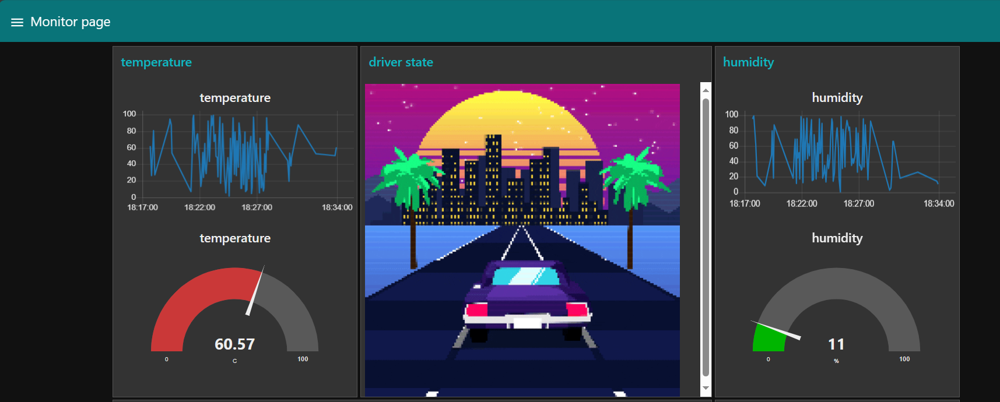
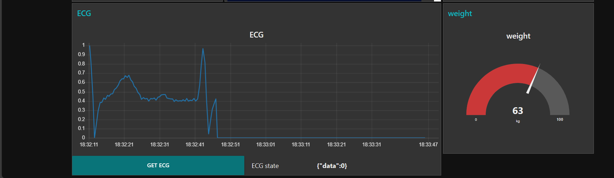
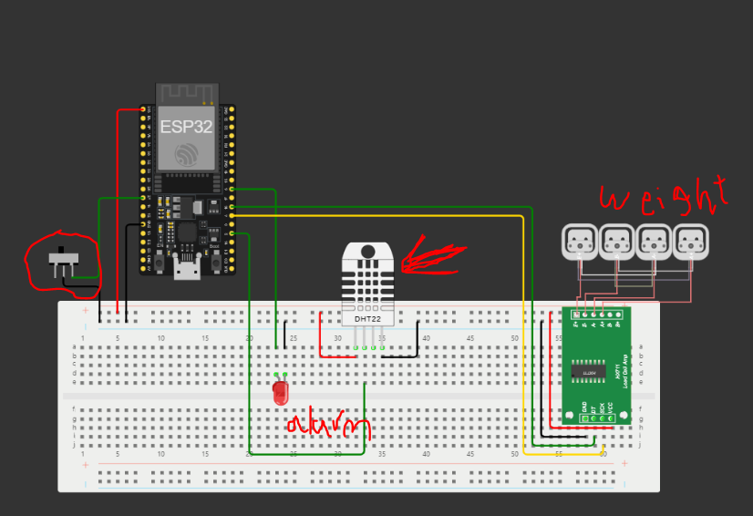

# Graduation project (NTI IoT & AI 1 month training)

## monitor your driver state
* demo [youtube video](https://youtu.be/rkArNb37C5E?si=Y3enAnXd6P8mBB1m)
* tools
    - Node-Red (dashboard)
    - HiveMQ (Broker)
    - Mqtt protocol
    - python programming language
    - counterfit (virtual devices)
    - wokwi (esp23 simulator)
    - c programming for arduino

* images

 
  
 
 

### wokwi simulation
  